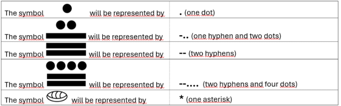

# The Mayans - InterFatecs 2025 (Problema A)

<h3>Descrição</h3>

A civilização Maia utilizava um sistema numérico vigesimal (base-20) muito sofisticado. Este projeto contém a resolução do Problema A da Maratona de Programação InterFatecs 2025 (Autor: Prof. Me. Sérgio Luiz Banin), que tem como objetivo converter números do sistema Maia para o sistema decimal moderno através de uma aplicação de console.

<h3>Símbolos Utilizados</h3>
No problema, a representação pictográfica maia foi adaptada para os seguintes caracteres ASCII:

* <b>'.'</b> (Ponto): Representa o valor 1.

* <b>'-'</b> (Traço/Hífen): Representa o valor 5.

* <b>'*'</b> (Asterisco): Representa o valor 0 (também atua como condição de parada na leitura de dados).

# Lógica e Regras
O sistema maia é posicional e baseado em potências de 20.

Uma combinação de pontos e traços forma um "dígito" maia.

Na entrada do programa, quando um número contém mais de um dígito, eles são separados por um espaço em branco.

A ordem de grandeza decresce da esquerda para a direita (o primeiro conjunto de símbolos multiplicará a maior potência de 20 aplicável ao tamanho da entrada, até chegar a 20⁰ no último).

# Entrada e Saída
<b>Entrada</b>: Consiste em várias linhas. Cada linha contém uma sequência de símbolos maias válidos (limitado a um máximo de 8 símbolos por linha, gerando um valor máximo de 20⁸ - 1). A leitura é finalizada ao encontrar um *.

<b>Saída</b>: Para cada linha lida, o programa calcula e imprime na tela o valor convertido para o nosso sistema decimal.
